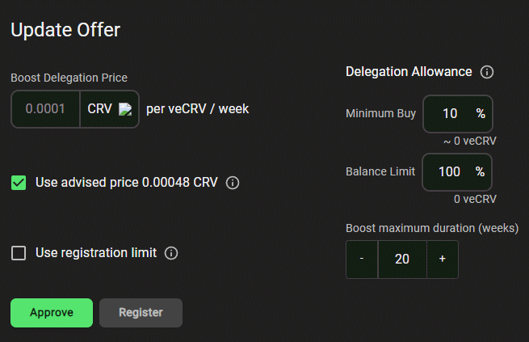

Asset Risk Assessment - Paladin / Warden
===============
### A risk assessment on the Paladin ecosystem for Curve veCRV holders and Pal LPs

This research was spearheaded by [@evmknows](https://twitter.com/evmknows).

## Useful links

 [Paladin website](https://paladin.vote/)  
 [Warden website](https://app.warden.vote/)  
 [Paladin documentation](https://doc.paladin.vote/)  
 [Paladin Github](https://github.com/PaladinFinance)  
 [Paladin multisig](https://etherscan.io/address/0x0792dCb7080466e4Bbc678Bdb873FE7D969832B8),
 [owners](https://gnosis-safe.io/app/eth:0x0792dCb7080466e4Bbc678Bdb873FE7D969832B8/settings/owners)  
 [Dune Analytics](https://dune.xyz/jjnnbbtt/Paladin.vote)  
 [Warden Quest Audit](https://github.com/spearbit/portfolio/blob/master/pdfs/Paladin-Spearbit-Security-Review.pdf)  
 [Paladin Audit](https://github.com/pessimistic-io/audits/blob/914e35fdfc879451a61d2a3969f3be839b8c808f/Paladin%20Security%20Analysis%20by%20Pessimistic.pdf)  
 [Podcast: Voting Markets, with Paladin's Romain Figuereo](https://anchor.fm/i-pledge-allegiance/episodes/Voting-Markets--with-Paladins-Romain-Figuereo-e1foigm)

## Abstract
With the introduction of lendable governance power, Paladin fills a yet unfilled niche within governance voting markets. In the first part of this review, we will cover Paladin and assess the relevant risks for its users including LPs. Lastly, we will assess the Warden products, which were designed for veTokens due to their fundamental differences from classic governance tokens, i.e. no possibility to lend generalized governance power.

## Paladin Protocol Overview
The Paladin protocol allows users to non-custodially lend the governance power of various protocols. The way it operates resembles that of a lending protocol. When a user deposits his tokens into a pool, they are released for borrowing. When a user borrows the governance rights, the [PalPool](https://doc.paladin.vote/paladin-protocol/palpool) creates a [PalLoan](https://doc.paladin.vote/paladin-protocol/palloan) (ERC-721) which represents the borrowing position. The borrowing fees are paid in advance by the user, after which the governance rights are delegated to the borrower.

At any time, the borrower can change the recipient of his borrowed governance rights, extend or close the borrowing position. All unused fees will be returned to the borrower should he close his position earlier than initially desired. Conversely, the borrowing position is automatically closed if all fees (that were prepaid and held in custody) are used up.

### Pools as a Faster Means of Exiting Staked Gov. Power
Since not every protocol allows users to unstake their governance tokens without a delay, it is possible (e.g. in the case of PalStkAave) to [exit a gov. lending position via a pool](https://gov.paladin.vote/t/using-palstkaave-as-a-liquid-wrapper-for-staked-aave/141). This pool is incentivized by Paladin and serves to improve the user experience of their protocol.

### Risk Summary:
* **For LPs:**

Significant depegs (e.g. PalStkAave/Aave) do not pose too much risk for liquidity providers, since in the case of a lopsided pool balance the LP can rebalance the pool within 10 days. This can be achieved at no cost by withdrawing PalStkAave, unwrapping, unstaking Aave, and redepositing back into the pool. Ideally, this rebalancing should occur before the pool enters a lopsided state to provide sufficient depth (which translates into volume & fees) at all times. 

Further risks for LPs arise from individual protocol-related risks for which the liquidity is provided. For example, in the case of StkAave, should there be any shortfall event, [Aave will slash up to 30% of StkAave to cover the deficit](https://docs.aave.com/aavenomics/safety-module), which in turn would cause PalStkAave (like any other StkAave derivative) to depeg.
    

* **For lenders/borrowers:**

The Paladin protocol has been [audited by Pessimistic on 1st Oct 2021](https://github.com/pessimistic-io/audits/blob/914e35fdfc879451a61d2a3969f3be839b8c808f/Paladin%20Security%20Analysis%20by%20Pessimistic.pdf), whereby no critical issues were found. However, users should be aware of the elevated multisig rights (as per the audit):
> In the [PaladinController](https://etherscan.io/address/0xCf131548B18D55Fb29DF2df47b360C41389EbB2b#code) contract, an admin can:
> * Withdraw all tokens from the reserve using `removeReserve()` function.
> * Block pool transactions by providing an incorrect controller address in `setPoolsNewController()` function or by removing the pool with `removePool()` function call.
> 
> In the [AddressRegistry](https://etherscan.io/address/0x90e0f42f5c6cdcc77bc68a545f27e56e4398b75f#code) contract, an admin can front-run users' transactions and change the address of the pool using `_setPool()` function.
> 
> In the [PalPool](https://github.com/PaladinFinance/Paladin-Protocol/blob/main/contracts/PalPool.sol) contract, an admin can modify `interestModule`, `minBorrowLength`, and `killerRatio` variables that affect the operation of the whole system.
> 
> In the current implementation, the system depends heavily on the admin role.

Because the [multisig](https://etherscan.io/address/0x0792dCb7080466e4Bbc678Bdb873FE7D969832B8) controlling the admin role is composed of doxxed core developers, a trust assumption might be sufficient to lessen this risk.

[Multisig members](https://gnosis-safe.io/app/eth:0x0792dCb7080466e4Bbc678Bdb873FE7D969832B8/settings/owners) (3 of 5):  
[Figue](https://twitter.com/Figue_me) - Paladin  
[0xKoga](https://twitter.com/0xKoga) - Paladin  
[tomo](https://twitter.com/tomoamiri) - Paladin  
[Greenfield One](https://twitter.com/Greenfield1One)  
[afromac](https://twitter.com/cormacndaly) - Index Coop  

In the future, the Paladin DAO intends to transfer the control over to the DAO once governance processes are refined and deployed on-chain.

## The Warden protocol
While the idea of lendable governance power introduces improvements to more trivially designed governance models, the opposite is the case for the vote-escrowed model. Given a high degree of (or absolute) permissionlessness within DAOs, the veModel acts as a protection mechanism against malicious governance behavior. By linking governance power to the duration of the lock period, an effort is made to align the long-term incentives between the DAO and the governance participants. An essential component to maintain the integrity of this mechanism is a whitelist that only allows contracts selected by the DAO to lock CRV. Accordingly, [it is intended that the locking mechanism cannot be circumvented](https://cryptorisks.substack.com/p/the-vetoken-standard), e.g. through tradable veCRV derivatives.

This is a significant difference from other governance models, which was also the reason why separate products labeled “Warden” were developed to specifically cater to veCRV and other veTokens.

### Warden boost
The first product in the Warden line is based on the ability to delegate the veBoost to another address, enabling the aggregation of boosted Liquidity Gauge rewards at a single address. The veBoost represents a second non-transferrable token that correlates 1:1 with the locked veCRV position. This veBoost determines (depending on other participants' share of veBoost) the individual share of CRV rewards distributed by the Liquidity Gauge. The more veCRV a user has locked, the more veBoost he is able to utilize during liquidity provision to earn a higher share of the liquidity incentives. Accordingly, through [veBoost delegation](https://github.com/curvefi/curve-veBoost), Warden boost allows this [boosting element of veCRV](https://resources.curve.fi/reward-gauges/boosting-your-crv-rewards) to be rented/leased independently of the underlying voting rights ([see docs for more details](https://doc.paladin.vote/warden/boost-market)). As can be seen from the image below, the lease offer can be configured very precisely.

Thus, the risks associated with a lease can be limited in advance.

### Warden quest
The Warden quest product offers a solution that allows protocols to set a budget, duration, the desired amount of votes, and a fixed price per veCRV for gauge vote weights. This distinguishes it from other protocols (e.g. [Votium](https://votium.app/) or Andre’s [bribe.crv.finance](https://bribe.crv.finance/)/[yBribe](https://ybribe.com/)) where an arbitrary amount can be deposited as an incentive to influence voters. In case the budget remains unused throughout several voting periods, the protocol can withdraw its incentives or adjust the conditions at any time.

For more information on how to create a quest or claim rewards see the [documentation](https://doc.paladin.vote/warden-quest/introduction).

The [audit for Warden quest](https://github.com/spearbit/portfolio/blob/master/pdfs/Paladin-Spearbit-Security-Review.pdf) was carried out by Spearbit whereby all except one issue were resolved. This is due to the fact that Paladin wanted to give its users the possibility to accumulate their earnings over several voting periods. Because the gauge contract does not store information about the past votes of a user, additional work is required to keep track of the votes. For that to happen, a manual (off-chain) process is required to create the [Merkle Trees](https://medium.com/crypto-0-nite/merkle-proofs-explained-6dd429623dc5), which are needed for operational gas efficiency. Thus, there exists a high reliance on an accurate Merkle Tree generation.

## Conclusion
As far as the Warden products are concerned, no noteworthy risks could be identified. Both products do not represent a veCRV derivative, rather contracts that manage only the functional aspects of veCRV. This non-custodial property limits even worst-case hypothetical risks (e.g. the inability to claim bribe rewards due to faulty Merkle Trees) to a minimum.

As for the risks regarding Paladin, these are mainly confined within the powers of the multisig. Since trust assumptions can be made by virtue of the reputation and public disclosure of the multisig participants (doxxed to the [fund](https://twitter.com/Greenfield1One)), the risk can likewise be considered minimal in this case.

In summary, the Paladin protocol primarily targets the pain point of governance scalability within DAOs that can be effectively solved through delegation. Thus, it can be said that the Paladin protocol contributes a positive value add to governance within the DeFi ecosystem.

